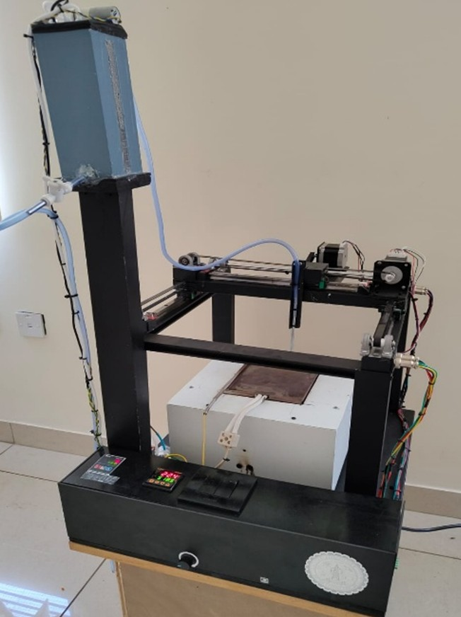
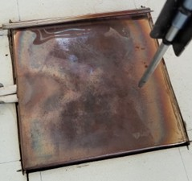
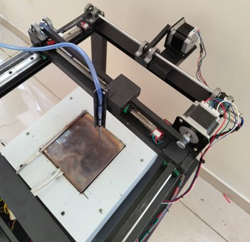
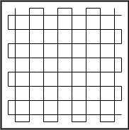
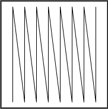
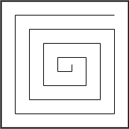
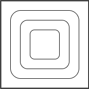
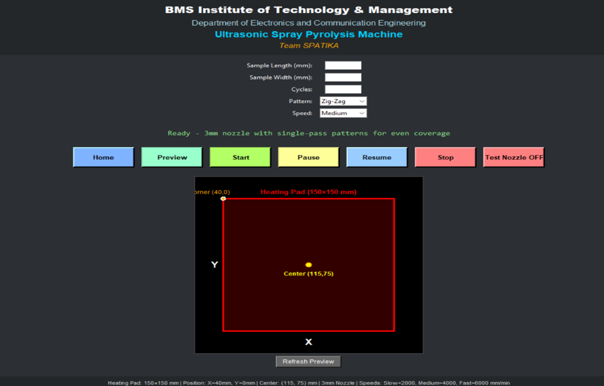

# Low-Cost Ultrasonic Spray Pyrolysis System for Thin Film Deposition

> A GRBL-controlled two-axis CNC ultrasonic spray pyrolysis unit for uniform thin-film deposition — built as an affordable alternative to commercial systems that cost orders of magnitude more.


---

## 🔬 What Is Spray Pyrolysis?

Ultrasonic Spray Pyrolysis (USP) is a thin-film deposition technique used to coat substrates with metal oxides, semiconductors, photovoltaic absorbers, catalytic layers, and functional coatings. A precursor solution is atomized into fine droplets by ultrasonic vibrations, then delivered onto a heated substrate where solvent evaporation and thermal decomposition form a solid film.

**Why ultrasonic (not conventional spray)?**

Conventional pressure-based sprayers produce large, high-momentum droplets that splash and cause the "coffee-ring effect" — solute accumulates at droplet edges, giving non-uniform films. Small nozzles clog easily. Ultrasonic atomization generates micron-sized, uniform, low-momentum droplets with no nozzle — solving both problems.

**Why build one?** Commercial USP systems cost tens of thousands of dollars. This project delivers comparable lab-grade performance at a fraction of the cost, making thin-film research accessible to any academic lab.

---


## 🎯 Problem Statement

Commercial automated spray pyrolysis units are prohibitively expensive for academic labs and suffer from:
- Large droplets → splashing, coffee-ring effect, non-uniform films
- Small nozzles → condensation and clogging, interrupted operation
- Non-modular, closed design → no flexibility for custom research setups
- Expensive maintenance for specialized components

This project addresses all these issues with an ultrasonic, open-source, CNC-driven approach.
<p align="center">
  
</p>

<p align="center">
   Complete assembled ultrasonic spray pyrolysis system including CNC motion platform, ultrasonic atomizer, heated substrate stage, and control electronics.
</p>
---

## 🏗️ System Design

### Core Principle

```
[Precursor Solution]
        ↓
[Ultrasonic Atomizer (1–2 MHz)]  ← generates fine, uniform microdroplets
        ↓
[Aerosol Transport]
        ↓
[CNC XY Platform] ← GRBL G-code raster scan over heated substrate
        ↓
[Heated Substrate (temperature-controlled)]
        ↓
  Solvent evaporation → Thermal decomposition → Solid thin film
```
<p align="center">
  
</p>

<p align="center">
 System block diagram illustrating ultrasonic atomization, aerosol transport, CNC motion control, and heated substrate deposition process.
</p>

<p align="center">
  
</p>

<p align="center">
  Process flow of the ultrasonic spray pyrolysis deposition mechanism from precursor solution atomization to thin-film formation.
</p>

### Two-Axis CNC Motion Platform

- **Controller**: Arduino with GRBL firmware
- **Motors**: NEMA stepper motors on X and Y axes
- **Motion pattern**: Programmable G-code raster scan — adjustable step size, overlap %, and scan area
- **Purpose**: Ensures uniform precursor coverage across the entire substrate, not just the centre
<p align="center">
  
</p>

<p align="center">
   Ultrasonic atomization and heated deposition region used for controlled thin-film formation on the substrate.
</p>

<p align="center">
  
</p>

<p align="center">
   CNC-controlled nozzle movement used for precise raster scanning and uniform precursor deposition.
</p>

### Grid Motion

<p align="center">
  
</p>

<p align="center">
   Grid-based raster scan pattern used for uniform coating deposition across the substrate.
</p>

---

### Zigzag Motion

<p align="center">
  
</p>

<p align="center">
   Zigzag scanning strategy for continuous deposition with reduced motion overhead.
</p>

---

### Spiral Motion

<p align="center">
  
</p>

<p align="center">
   Spiral deposition path demonstrating alternative substrate coverage methodology.
</p>

---

### Loop Motion

<p align="center">
  
</p>

<p align="center">
   Closed-loop motion trajectory for repeated localized thin-film deposition studies.
</p>
---

## 🔧 Hardware Components

| Component | Purpose |
|---|---|
| Ultrasonic Atomizer (1–2 MHz transducer) | Generates fine, uniform microdroplets without a nozzle |
| Arduino Uno + GRBL Shield | CNC motion controller |
| NEMA Stepper Motors (2x) | X and Y axis movement |
| Heated Substrate Stage | Maintains deposition temperature; controls pyrolysis quality |
| Temperature Controller / Relay | Regulates substrate temperature |
| Aerosol Guide Channel | Directs mist from atomizer to substrate uniformly |
| Peristaltic Pump / Syringe Pump | Controlled precursor solution feed rate |
| Frame / Enclosure | Mechanical structure for the XY gantry and substrate stage |

---

## ⚙️ Key Parameters & How to Control Them

| Parameter | Effect on Film | How to Adjust |
|---|---|---|
| Ultrasonic frequency | Controls droplet size | Use appropriate transducer frequency |
| Substrate temperature | Controls decomposition completeness | Adjust heater setpoint |
| Scan speed (G-code feed rate) | Controls deposition rate per pass | Edit G-code `F` parameter |
| Step overlap (% raster) | Controls coating uniformity | Adjust raster line spacing in G-code |
| Precursor concentration | Controls film thickness | Adjust solution molarity |
| Number of passes | Controls total film thickness | Repeat G-code program N times |

---

## ✅ Results

- ✅ Uniform thin-film deposition validated across multiple substrate runs
- ✅ Repeatable film thickness confirmed across identical deposition runs
- ✅ Eliminated coffee-ring effect and splashing vs. conventional spray
- ✅ Zero nozzle clogging incidents during long-duration tests
- ✅ Fully functional modular prototype suitable for metal-oxide, photovoltaic, and catalytic thin-film research


<p align="center">
  
</p>

<p align="center">
   System monitoring and motion-control interface used for configuring deposition parameters and observing system operation.
</p>
---

## 💡 Advantages Over Commercial Systems

| Feature | Commercial USP Systems | This Project |
|---|---|---|
| Cost | Very high (₹10L+) | Low (academic budget) |
| Modularity | Fixed, closed design | Fully open, customizable |
| Motion control | Proprietary software | Open G-code (GRBL) |
| Nozzle clogging | Possible | Eliminated (ultrasonic) |
| Droplet uniformity | High | High |
| Adaptability for new precursors | Limited | Unrestricted |
| Footprint | Large, dedicated space | Compact, bench-top |

---

## 🔮 Applications

The system is suitable for research-grade deposition of:
- Metal oxide thin films (ZnO, TiO₂, SnO₂, Fe₂O₃)
- Photovoltaic absorber layers (CZTS, ZnS buffer layers)
- Transparent conducting oxides (TCO)
- Catalytic coatings for chemical sensors
- Dielectric layers for electronic devices

---

## 👤 Author

**Sri Srujan Hari T**
ECE, BMSIT&M | 2025
